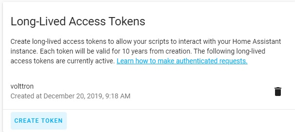

# volttron-homeassistant
Volttron agent for homeassistant integration.  It uses the Home Assistant websocket API for low-latency anycronous communication between volttron agents and entities within Home Assistant.

# agent configuration
The agent is configured with three settings.

| name        | description           |
| ------------- |:-------------:|
| ip_address      | The IP address of your Home Assistant server |
| access_token     | The long lived access token for the websocket API (see how to generate one below) |
| topic | The base topic for publishing entity state changes as they occur (see syntax below)     |

# Getting an access token
The easiest way to generate a token is from the bottom of your Home Assistant profile page.

